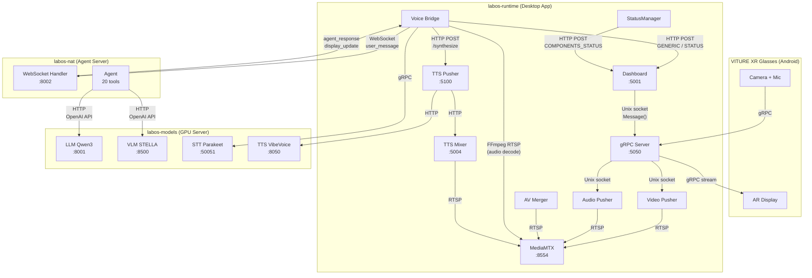

# LabOS System Architecture

This document describes how all three LabOS components communicate.

## Components

| Component | Repo | Purpose | Deployment |
|---|---|---|---|
| **labos-models** | `labos-models/` | GPU model hosting (LLM, VLM, STT, TTS) | GPU server |
| **labos-nat** | `labos-nat/` | Agent server (tool-calling, protocol management) | Cloud or GPU server |
| **labos-runtime** | `labos-runtime/` | Desktop XR app (glasses, streaming, voice) | User's desktop/laptop |

## Network Diagram



## Communication Protocols

### 1. Glasses <-> gRPC Server (gRPC, port 5050)

The VITURE XR glasses connect to the gRPC server binary (`main.bin`) over TCP. The gRPC server exposes five bidirectional streams:

- `StreamEncodedFrames` -- server sends rendered frames to glasses display
- `ServerToClientStreamAudio` -- server sends TTS audio to glasses speakers
- `ClientToServerStreamAudio` -- glasses send microphone audio to server
- `ServerToClientGenericMessage` -- server sends `Message(type, payload)` to glasses
- `ClientToServerGenericMessage` -- glasses send messages to server

The gRPC server also creates a Unix domain socket at `/tmp/xr_service.sock` for local IPC with other services (video pushers, dashboard, voice bridge).

### 2. Voice Bridge <-> NAT Server (WebSocket, port 8002)

Connection URL: `ws://<nat-host>:8002/ws?session_id=<id>`

**Inbound (Runtime -> NAT):**

| Message Type | Payload | Trigger |
|---|---|---|
| `user_message` | `{text}` | User speech passes STT + wake word filter |
| `frame_response` | `{request_id, frames[]}` | Response to NAT's `request_frames` |
| `stream_info` | `{camera_index, rtsp_base, paths}` | Sent once on connection |
| `ping` | `{}` | Keepalive |

**Outbound (NAT -> Runtime):**

| Message Type | Payload | Action in Runtime |
|---|---|---|
| `agent_response` | `{text, tts}` | Show as GENERIC on glasses, trigger TTS if flagged |
| `notification` | `{text, tts}` | Show as GENERIC, optional TTS |
| `display_update` | `{message_type, payload}` | Forward directly to glasses (e.g., SINGLE_STEP_PANEL_CONTENT) |
| `request_frames` | `{request_id, count, interval_ms}` | Capture camera frames, return as `frame_response` |
| `tts_only` | `{text, priority}` | Speak without displaying |
| `wake_timeout` | `{seconds}` | Update wake word timeout dynamically |

### 3. Voice Bridge <-> STT Service (gRPC or HTTP)

- **gRPC mode** (default): Connects to NIM Parakeet on port 50051 using Riva ASR protocol
- **HTTP mode**: POSTs raw PCM to `/transcribe` endpoint
- Audio format: 16-bit signed LE, 16 kHz, mono, 100ms chunks (3200 bytes)

### 4. NAT Server <-> LLM/VLM (HTTP, OpenAI-compatible API)

The NAT server uses the OpenAI Python SDK to call the LLM and VLM:

| Model | Endpoint | Usage |
|---|---|---|
| LLM (Qwen3) | `http://<models-host>:8001/v1` | Agent tool-calling loop, conversation |
| VLM (STELLA) | `http://<models-host>:8500/v1` | Visual monitoring, ad-hoc image queries |

Both use the standard `/v1/chat/completions` API with tool definitions.

### 5. Runtime TTS Pipeline (HTTP + RTSP)

```
Voice Bridge                TTS Pusher               VibeVoice Model        TTS Mixer          MediaMTX
    |                           |                        |                     |                  |
    |--POST /synthesize-------->|                        |                     |                  |
    |                           |--POST /generate------->|                     |                  |
    |                           |<------WAV bytes--------|                     |                  |
    |                           |--POST /play (WAV)----->|                     |                  |
    |                           |                        |                     |--RTSP push------>|
    |                           |                        |                     |                  |--audio-->Glasses
```

### 6. Glasses Display Pipeline (HTTP + Unix Socket + gRPC)

```
Voice Bridge / NAT          Dashboard                 gRPC Server            Glasses
    |                           |                        |                     |
    |--POST /api/send_message-->|                        |                     |
    |  {message_type, payload}  |                        |                     |
    |                           |--Message() via socket->|                     |
    |                           |                        |--gRPC stream------->|
    |                           |                        |  (GenericMessage)   |--Display on AR-->
```

## Message Types for Glasses

| Type | Panel | Payload Schema |
|---|---|---|
| `GENERIC` | LLM Chat | `{"message": {"type": "rich-text", "content": "<TMP markup>", "source": "Agent/User"}}` |
| `SINGLE_STEP_PANEL_CONTENT` | Step Panel | `{"messages": [{"type": "rich-text/base64-image", "content": "..."}]}` |
| `COMPONENTS_STATUS` | Status Bar | `{"Voice_Assistant": "idle/listening", "Server_Connection": "active/inactive", "Robot_Status": "..."}` |
| `AI_RESULT` | SOP Panel | `{"key": "N", "value_state": "COMPLETED/STARTED/...", "message": "..."}` |

## Port Reference (All Services)

| Service | Port | Protocol | Stack |
|---|---|---|---|
| gRPC Server | 5050 | gRPC (TCP) | labos-runtime |
| MediaMTX RTSP | 8554 | RTSP | labos-runtime |
| MediaMTX HLS | 8890 (host) / 8888 (container) | HTTP | labos-runtime |
| MediaMTX WebRTC | 8889 | WebRTC | labos-runtime |
| Dashboard | 5001 | HTTP | labos-runtime |
| TTS Pusher | 5100 (host) / 5000 (container) | HTTP | labos-runtime |
| TTS Mixer | 5004 (host) / 5002 (container) | HTTP | labos-runtime |
| NAT Server | 8002 | WebSocket + HTTP | labos-nat |
| LLM (Qwen3) | 8001 | HTTP (OpenAI) | labos-models |
| VLM (STELLA) | 8500 | HTTP (OpenAI) | labos-models |
| STT (Parakeet) | 50051 | gRPC | labos-models |
| TTS (VibeVoice) | 8050 | HTTP | labos-models |
| Shinobi NVR | 8088 | HTTP | labos-runtime (optional) |
| MySQL (NVR) | 9906 | MySQL | labos-runtime (optional) |

## Deployment Topologies

### Co-located (Development)

All three stacks on one machine. Services find each other via Docker network `labos-net` using container names (`labos-llm`, `labos-vlm`, `labos-stt`, `labos-tts`, `labos_nat_server`).

### Split (Production)

| Machine | Runs | Config |
|---|---|---|
| GPU Server | labos-models + labos-nat | Services connect locally |
| Desktop | labos-runtime | `config.yaml` points NAT URL and STT/TTS to GPU server IP |

### Fully Split

| Machine | Runs | Connects To |
|---|---|---|
| GPU Server A | labos-models | Exposes ports 8001, 8500, 50051, 8050 |
| Server B | labos-nat | Points `models.llm.base_url` / `models.vlm.base_url` to GPU Server A |
| Desktop | labos-runtime | Points `nat_server.url` to Server B, `speech.stt/tts` to GPU Server A |

## Security Notes

- **API keys** (NGC, HuggingFace, SerpAPI) live only in `labos-models/.env.secrets` and `labos-nat/.env.secrets`, never on the desktop app.
- The desktop app (`labos-runtime`) has zero secrets -- it only points to endpoints.
- WebSocket and HTTP connections are unencrypted by default. For production, use a reverse proxy with TLS.
- The `ws_protocol.py` file is shared between labos-nat and labos-runtime. Keep both copies in sync when modifying the protocol.
